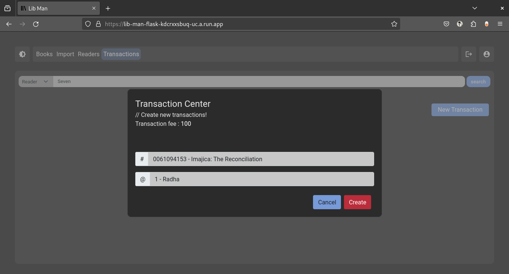
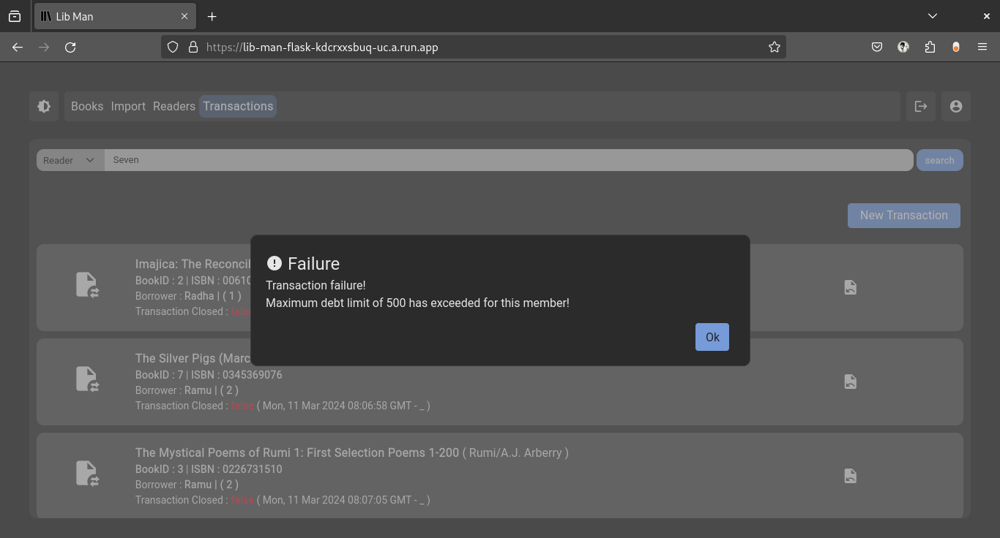

# Lib Man (A Library Manager)
Nothing special, just a fullstack app for library management :) [More like a simple project build within 2 days buffer (mostly hiring oriented)] 

**See it in action** : [lib-man-flask-kdcrxxsbuq-uc.a.run.app](https://lib-man-flask-kdcrxxsbuq-uc.a.run.app) <br>
Somebody insists for the brownie points :)
If you got stuck say the magic words : `admin` and [`passowrd`](#features). 

**Jump Into The [Screenshots](#screens)**  

## About the APP
1. It was meant to be simple as possible. Both visually and technically.
2. **I write the entire application in a purism perspective (Like build it from scratch kind of thing).** 

> It was challenging to build something from more basic libraries. (But I honestly felt the pain though!)

**For the bellow kind of questions,**

Why use flask? 
<br>What you are not even using jquery (I used bootsrap BTW)? 
<br>You could have made it in django within few hours?
<br>Wait have you trying to mimic reusable components in pure js?

**I got this answer :** I was doing a show of kind of project. I know these stuffs and I used to use these. So I took it as a challenge to build all of them within 2 days.

I didn't meant it's a whole awesome one. I got a lot of redundant code over here and there. But it's build within **2days** (time matters). [at-least a personal best] 

### Major Libraires in use

1. [Flask](https://flask.palletsprojects.com/en/3.0.x/)
2. [SQLAlchemy](https://www.sqlalchemy.org/)
3. [Bootstapv5](https://getbootstrap.com/docs/5.0/getting-started/introduction/)
4. [Pydantic](https://docs.pydantic.dev/latest/)
5. [Alembic](https://alembic.sqlalchemy.org/en/latest/)
6. [Gunicorn](https://gunicorn.org/)
7. [Loguru](https://github.com/Delgan/loguru)
7. [Podman](https://podman.io/)
8. [WebPack](https://webpack.js.org/)
9. [pictogrammers](https://pictogrammers.com)

Languages : `Python3.10`, `JS (>ES6)`, `bash (Makefile)`

special mention to : [devC](https://bruttazz.github.io/devc) :)


### Hosting
There is no free hosting now a days :| Going with freemium alternative GCP Cloud Run.


## Running the server
> **NB**: there is a simple to use Makefile

Start with a simple make command for detailed usage example
```sh
make
```

#### Managing Configurations
Create a config file similar to `example.env` file in the root-directory, and run the system.
If you want to go with a fancy name like `something.env` for your configuration, then set the environment variable `CONFIG_TYPE` to the corresponding one.

For loading the example config itself,
```sh
export CONFIG_TYPE=example
```
and then start running the system, it will take `example.env` as the config file. 

**NB** : If you are naming your config file as `.env`, you don't want to set an explicit `CONFIG_TYPE` env variable. 

Yeah! you got it. It's me making it super lengthy.

## Features
1. There is a migration script
2. there is only one admin user (it's feature). default username and password : `admin` and `passowrd` respectively can be change latter on using the env variable. 
3. There is a fully fledged ui navigation and auto rendering. Somewhat reusable components (like ones).
4. There is a single functional search bar
5. UI is responsive, minimal dual theme supported, single-paged, etc..
6. Simple JWT based validation
7. Relational db, and validations
8. Extensible validation and authentication decors,
9. Realtime search appearance (Transaction creation portion), pagination, etc.
10. And most of the basic boring things..

**NB**: Mainly it satisfies the requirements of [frappe-hiring](https://frappe.io/dev-hiring-test)


### Screens

* 

* 

* 

* 

* 

* 

* 

* 

* 

<!-- * 

sdsd -->
* 

* 

* 

* 

* 

* 

* 

* 

* 

* 

* 

* 

* 

**And it comes in white as well**

* 

* 

#### And the "responsive" samples


### ToDos
1. has to migrate to sqlmodel to avoid sqlalachmey & pydantic related bug fixes 
2. And a lot more..